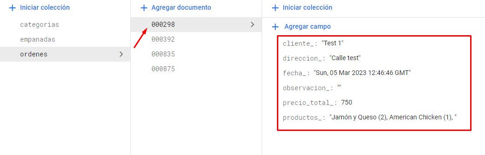

# E-commerce de empanadas

## Descripción general

Una web diseñada para la venta de **empanadas** al consumidor final. Cuenta con un gestor de ordenes de pedidos que se almacenan en una base de datos NoSQL. Se utilizaron librerías de estilo (chakra-ui) para crear una visual ordenada.

## Multimedia




## Librerías utilizadas

- [Chakra-ui](https://chakra-ui.com/) - Librería de estilo predeterminados.
- [React-router-dom](https://reactrouter.com/en/main) - Para la creación de rutas dinámicas.
- [Firebase](https://firebase.google.com/) - Base de datos NoSQL.

## Installation

En líneas de comando, ingresar al root y correr el siguiente código.

```sh
npm run dev
```

## Proyecto en la web

| Página   | Link                                                                                                                                                    |
| -------- | ------------------------------------------------------------------------------------------------------------------------------------------------------- |
| GitHub   | [github.com/marianoezequielmendez](https://github.com/marianoezequielmendez/react_coderhouse)                                                           |
| Firebase | [console.firebase.google.com](https://console.firebase.google.com/u/0/project/react-coderhouse-91364/firestore/data/~2Fcategorias~2Fclasicas?hl=es-419) |

## License

MIT
**Free Software**
